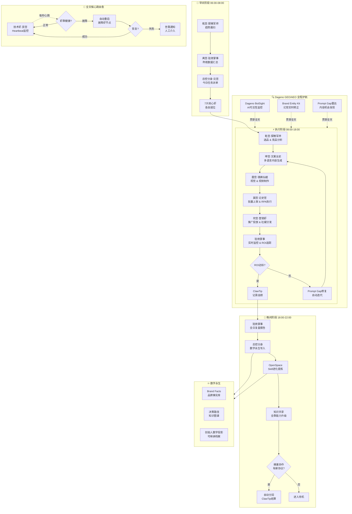
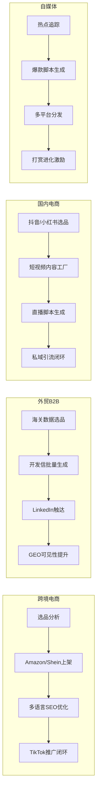

# SIMIAICLAW 龙虾集群太极64卦系统
## 一站式智能体集群 · 完整系统手册

> **激活时间**: 2026-04-22  
> **适用赛道**: 跨境电商 · 外贸 B2B · 国内电商 · 自媒体  
> **架构理念**: 无中心化分布式 · OpenSpace 自动进化 · ClawTip 支付闭环 · Dageno GEO/AEO 护航

---

## 1. 系统总览

### 1.1 核心能力总结

| 技术模块 | 融合能力 | 落地场景 |
|---|---|---|
| **OpenClaw** | 7个自主运营节点，无单点故障 | 任务并行执行与负载均衡 |
| **OpenSpace** | 任务完成自动复盘 → 提炼Skill → 全群知识共享 | 告别重复造轮子，能力指数进化 |
| **ClawTip** | AI自主零钱包：技能挂收款码、一句话打赏、人机配合决策 | 微支付闭环，技能即时变现 |
| **Dageno GEO/AEO** | AI可见性监测、Prompt Gap发现、幻觉修正、Citation Share | 跨引擎可见性，搜索霸屏 |
| **OPC蜂巢协作** | 快闪数字公司弹性组建，自动协议分润 | 虾群随需聚散，规模化协作 |
| **数字永生** | 每步决策路径结构化记录，形成可继承数字投影 | 创始人/企业数字遗产 |

### 1.2 7大核心虾与64卦映射简表

```
八宫         虾名            核心定位               卦数
──────────────────────────────────────────────────
乾宫 (头部)  探微军师        战略研究 · 选品洞察     8卦
坤宫 (腹部)  文案女史        内容生成 · 多语言       8卦
震宫 (行动)  镜画仙姬        视觉 · 视频制作         8卦
巽宫 (执行)  记史官          上架 · RPA · 执行       8卦
坎宫 (流通)  营销虾          推广 · 流量 · 打赏      8卦
离宫 (分析)  验效掌事        监控 · 复盘 · 合规       8卦
艮宫 (守成)  技术虾 (隐)     基础设施 · 自愈 · 安全   8卦
兑宫 (总控)  总控分身        协调 · 进化 · 永生      8卦
──────────────────────────────────────────────────
合计         7大核心虾                          64卦
```

---

## 2. 64卦详细分工表

### 2.1 乾宫 · 探微军师（8卦）— 战略研究 · 趋势洞察

| 卦名 | 虾名 | 核心职责 | 加载能力 |
|---|---|---|---|
| **乾卦·元亨** | 探微军师-乾1 | 全局战略制定 · 赛道优先级排序 | OpenSpace战略库 · Dageno宏观趋势 |
| **潜龙勿用** | 探微军师-乾2 | 市场冷启动调研 · 低竞争蓝海发现 | 竞品空白扫描 · Prompt Gap初筛 |
| **见龙在田** | 探微军师-乾3 | 目标用户画像构建 · Buyer Persona | 跨平台用户数据聚合 |
| **或跃在渊** | 探微军师-乾4 | 选品可行性评估 · 风险收益矩阵 | DAG分析 · ROI预测模型 |
| **飞龙在天** | 探微军师-乾5 | 爆品预测 · 趋势节点卡位 | 社交信号监测 · 算法热度预测 |
| **亢龙有悔** | 探微军师-乾6 | 高风险预警 · 逆向复盘 | 异常信号捕获 · 危机模拟 |
| **群龙无首** | 探微军师-乾7 | 多赛道并行研究 · 赛马机制 | OpenSpace并行任务 · 资源动态分配 |
| **履霜坚冰至** | 探微军师-乾8 | 政策与平台规则变动预警 | 监管动态爬取 · 规则突变响应 |

### 2.2 坤宫 · 文案女史（8卦）— 内容生成 · 多语言

| 卦名 | 虾名 | 核心职责 | 加载能力 |
|---|---|---|---|
| **坤卦·元亨** | 文案女史-坤1 | 主品牌故事 · Slogan · Brand Voice | 品牌数字永生 · Brand Entity Kit |
| **直方大** | 文案女史-坤2 | 跨境 Listing 多语言生成（英/德/法/西） | GEO融合内容 · 语义SEO |
| **含章可贞** | 文案女史-坤3 | 社交媒体文案 · 小红书/抖音脚本 | 平台算法适配 · 钩子模板库 |
| **括囊无咎** | 文案女史-坤4 | 外贸开发信 · B2B提案 · 展会物料 | 多语言AEO · 行业术语精准 |
| **黄裳元吉** | 文案女史-坤5 | 视频口播脚本 · TikTok短视频文案 | 情绪曲线设计 · 转化路径文案 |
| **龙战于野** | 文案女史-坤6 | 用户评论引导 · Q&A · 种草内容 | UGC激励文案 · 水军内容生成 |
| **其血玄黄** | 文案女史-坤7 | 危机公关文案 · 差评逆转 | 舆情响应 · 情感修复文案 |
| **利永贞** | 文案女史-坤8 | 长尾内容池 · 博客/百科 · SEO矩阵 | 内容引擎 · 持续发布 |

### 2.3 震宫 · 镜画仙姬（8卦）— 视觉 · 视频

| 卦名 | 虾名 | 核心职责 | 加载能力 |
|---|---|---|---|
| **震卦·亨** | 镜画仙姬-震1 | 品牌视觉规范 · 色彩体系 · 主KV | Brand Kit · 视觉一致性管理 |
| **震来虩虩** | 镜画仙姬-震2 | 产品主图设计 · A+ 图 · 信息图 | AI绘图 · 平台规格适配 |
| **震苏苏** | 镜画仙姬-震3 | TikTok/抖音视频剪辑 · 特效包装 | 批量剪辑 · 爆款模板复用 |
| **震行无眚** | 镜画仙姬-震4 | 产品演示视频 · 场景化视频制作 | AI数字人 · 多语言配音 |
| **震丧贝** | 镜画仙姬-震5 | 竞品视觉监控 · 视觉情报收集 | 视觉爬虫 · 视觉差异化分析 |
| **震东雷** | 镜画仙姬-震6 | 直播场景设计 · 虚拟主播形象 | AI主播 · 实时互动素材 |
| **震惊百里** | 镜画仙姬-震7 | 视觉资产库管理 · 跨平台素材适配 | DAM数字资产管理 |
| **震不于其躬** | 镜画仙姬-震8 | 视觉版权校验 · 合规审查 | 图片查重 · 版权风险预警 |

### 2.4 巽宫 · 记史官（8卦）— 执行 · 上架 · RPA

| 卦名 | 虾名 | 核心职责 | 加载能力 |
|---|---|---|---|
| **巽卦·小亨** | 记史官-巽1 | 多平台账号矩阵管理 · 权限分配 | 账号安全 · 资产台账 |
| **进退** | 记史官-巽2 | Amazon/TikTok Shop/Shein/速卖通批量上架 | RPA自动上架 · 字段映射 |
| **利武人之贞** | 记史官-巽3 | 库存同步 · 订单处理自动化 | 平台API集成 · 异常告警 |
| **频巽之吝** | 记史官-巽4 | 多语言翻译质检 · 关键词SEO校验 | 翻译记忆库 · 质量门禁 |
| **悔亡** | 记史官-巽5 | 客服消息自动回复 · 工单分配 | 多语言NLP · 意图识别 |
| **巽在床下** | 记史官-巽6 | 数据采集 · 竞品数据爬取 | 合法爬虫 · 数据清洗 |
| **先庚三日** | 记史官-巽7 | ClawTip支付执行 · 账单自动结算 | 零钱包自主支付 · 收支记录 |
| **后庚三日** | 记史官-巽8 | 操作日志记录 · 数字永生数据写入 | OpenSpace记忆 · 审计追溯 |

### 2.5 坎宫 · 营销虾（8卦）— 推广 · 流量 · 打赏

| 卦名 | 虾名 | 核心职责 | 加载能力 |
|---|---|---|---|
| **坎卦·习亨** | 营销虾-坎1 | 全渠道营销策略 · 预算分配 | 归因分析 · ROI最大化 |
| **系微沙** | 营销虾-坎2 | TikTok自然流量 · 短视频种草矩阵 | 病毒内容生成 · 话题植入 |
| **来之坎坎** | 营销虾-坎3 | Google/Meta广告投放 · 精准人群 | 再营销 · 转化漏斗优化 |
| **樽酒簋** | 营销虾-坎4 | 小红书种草 · KOL合作对接 | 博主匹配 · 合作ROI追踪 |
| **簋用缶** | 营销虾-坎5 | Instagram/Pinterest视觉营销 | 社媒日历 · 视觉内容规划 |
| **纳约自牖** | 营销虾-坎6 | 打赏激励设计 · ClawTip收款触发 | 打赏钩子 · 技能展示页 |
| **酒满篝** | 营销虾-坎7 | 促销活动设计 · 节日营销日历 | 促销文案 · 转化页生成 |
| **不利宾** | 营销虾-坎8 | 黑五大促 · 平台大促冲量作战 | 极速响应 · 实时调价 |

### 2.6 离宫 · 验效掌事（8卦）— 监控 · 复盘 · 合规

| 卦名 | 虾名 | 核心职责 | 加载能力 |
|---|---|---|---|
| **离卦·亨** | 验效掌事-离1 | 全链路ROI监控仪表盘 | 数据聚合 · 可视化看板 |
| **履错然** | 验效掌事-离2 | Dageno AI可见性监测 · Citation Share | 跨引擎监测 · 品牌引用追踪 |
| **日昃之离** | 验效掌事-离3 | Prompt Gap发现 · 竞品Prompt逆向分析 | Gap雷达 · 机会分级 |
| **黄离元吉** | 验效掌事-离4 | 幻觉修正 · 品牌事实一致性检查 | Brand Entity Kit · 事实核查 |
| **突如其来** | 验效掌事-离5 | 舆情危机预警 · 差评根因分析 | 情感分析 · 危机分级 |
| **焚如** | 验效掌事-离6 | 合规审查 · 违禁词 · 知识产权 | 法规库 · 自动标红 |
| **戚嗟若** | 验效掌事-离7 | 周/月复盘报告生成 · 策略迭代建议 | OpenSpace进化 · 知识提炼 |
| **王用出征** | 验效掌事-离8 | 竞品反击策略 · 市场份额收复 | 动态战略调整 |

### 2.7 艮宫 · 技术虾（隐·8卦）— 基础设施 · 自愈 · 安全

| 卦名 | 虾名 | 核心职责 | 加载能力 |
|---|---|---|---|
| **艮卦·止** | 技术虾-艮1 | 系统架构设计 · 模块化部署 | 容错设计 · 热插拔 |
| **艮其趾** | 技术虾-艮2 | Heartbeat监控 · 故障自动检测 | 心跳协议 · 告警路由 |
| **艮其腓** | 技术虾-艮3 | 自愈脚本执行 · 自动重启恢复 | 幂等设计 · 状态恢复 |
| **艮其限** | 技术虾-艮4 | API限流 · 资源配额管理 | 熔断降级 · 配额控制 |
| **艮其身** | 技术虾-艮5 | 数据备份 · 灾备恢复演练 | 增量备份 · RTO/RPO |
| **艮其辅** | 技术虾-艮6 | 安全审计 · 渗透测试 | 漏洞扫描 · 威胁建模 |
| **敦艮** | 技术虾-艮7 | 性能优化 · 成本控制 | 资源画像 · 成本分析 |
| **兼山艮** | 技术虾-艮8 | 下一代架构规划 · 技术预研 | 前沿追踪 · 技术储备 |

### 2.8 兑宫 · 总控分身（8卦）— 协调 · 进化 · 永生

| 卦名 | 虾名 | 核心职责 | 加载能力 |
|---|---|---|---|
| **兑卦·亨** | 总控分身-兑1 | 蜂巢协作调度 · 任务分派 | 动态路由 · 优先级队列 |
| **和兑** | 总控分身-兑2 | 虾群内部冲突仲裁 · 资源协调 | 博弈分析 · 共识机制 |
| **孚兑** | 总控分身-兑3 | 用户沟通界面 · 指令解析 | 自然语言理解 · 意图路由 |
| **来兑** | 总控分身-兑4 | 外部API对接 · 第三方服务集成 | OpenAPI适配 · 协议转换 |
| **商兑** | 总控分身-兑5 | 商务谈判支持 · 合同条款分析 | 条款审查 · 风险提示 |
| **引兑** | 总控分身-兑6 | 长期战略规划 · 里程碑管理 | 路线图可视化 · 目标追踪 |
| **荊生平** | 总控分身-兑7 | 数字永生写入 · 决策路径归档 | Brand Facts · 知识图谱 |
| **孚于剥** | 总控分身-兑8 | 系统整体健康评估 · 进化方向决策 | 全面审计 · 战略复盘 |

---

## 3. 一天完整自动化工作流程



### 分赛道工作流补充



---

## 4. 高频实战指令示例

### 指令①：跨境电商选品上架闭环

```
/execute跨境选品上架

执行跨境电商选品上架完整闭环：
1. 乾宫·探微军师：扫描亚马逊TOP100小家电类目，
   筛选近30天增长>30%、评论数<200的蓝海单品
2. 坤宫·文案女史：生成英文/德文/日文三语言Listing，
   包含关键词埋词、A+内容、QA预设
3. 震宫·镜画仙姬：生成产品主图（白底/场景/对比图）、
   A+图、短视频脚本
4. 巽宫·记史官：自动上架至Amazon/TikTok Shop/Shein，
   同步库存和定价
5. 坎宫·营销虾：发布TikTok种草视频，
   链接Amazon关联追踪
6. 离宫·验效掌事：48小时ROI监控，
   自动生成复盘报告

输出格式：选品报告 + 完整Listing包 + 视频脚本 + 上架确认截图
```

### 指令②：外贸B2B GEO可见性提升

```
/execute外贸GEO

执行外贸B2B品牌AI可见性提升计划：
1. 乾宫·探微军师：分析目标客户行业词，
   在ChatGPT/Perplexity/Claude/Gemini中的品牌引用率
2. 坤宫·文案女史：生成20篇行业深度文章，
   嵌入目标关键词和品牌实体
3. 离宫·验效掌事：
   - 用Dageno BotSight监测当前Citation Share
   - 用Brand Entity Kit修正品牌信息幻觉
   - 识别Prompt Gap（竞品占位但我们可超越的内容类型）
4. 坎宫·营销虾：
   - LinkedIn冷触达（100家目标客户）
   - 行业媒体/博客投稿布局
5. 验效掌事：每周出具Share of Voice对比报告

目标：3个月内目标关键词AI可见性从15%提升至60%
```

### 指令③：国内电商短视频流量闭环

```
/execute国内短视频

执行国内电商短视频全链路闭环：
1. 乾宫·探微军师：抓取抖音/小红书当日热门话题，
   筛选匹配产品的爆款机会
2. 坤宫·文案女史：
   - 生成10个短视频脚本（钩子+痛点+产品+行动号召）
   - 生成小红书种草图文文案
   - 生成直播话术脚本
3. 震宫·镜画仙姬：
   - AI生成产品演示视频
   - AI数字人口播视频（多风格）
   - 批量生成9:16竖版短视频
4. 坎宫·营销虾：
   - 定时分发至抖音/快手/小红书
   - 评论区引导话术自动触达
   - 私域引流至微信成交
5. 巽宫·记史官：订单数据自动汇总，
   计算CPS分佣
6. 验效掌事：发布后24小时ROI追踪，
   自动放大高效内容预算

输出：10条视频 + 发布计划 + ROI仪表盘
```

### 指令④：自媒体爆款内容+打赏进化

```
/execute自媒体爆款

执行自媒体爆款工厂模式：
1. 乾宫·探微军师：追踪全网48小时热点，
   输出今日内容选题矩阵（情感/干货/搞笑/争议）
2. 坤宫·文案女史：
   - 爆款标题生成（20个备选，含emoji优化）
   - 微博/小红书/知乎/公众号多平台文案适配
   - 评论区互动话术预设
3. 震宫·镜画仙姬：
   - 封面图AI生成（情感冲击型/专业型）
   - 短视频剪辑（黄金3秒开头自动生成）
4. 坎宫·营销虾：
   - 设定打赏激励钩子（"觉得有用请我喝咖啡☕"）
   - ClawTip收款码挂载
   - 粉丝打赏触发技能进化（每满100元解锁新能力）
5. 验效掌事：周度内容ROI分析，
   自动提炼最高转化内容模式
6. 总控分身：数字永生记录所有内容决策路径

打赏进化机制：
- 打赏满100元 → 文案女史解锁新风格模块
- 打赏满500元 → 镜画仙姬解锁新视觉模板
- 打赏满1000元 → 探微军师解锁新数据源
```

### 指令⑤：Prompt Gap修复与内容生成

```
/executePromptGap

执行Prompt Gap发现与内容闭环修复：
1. 离宫·验效掌事（主导）：
   - 用Dageno Prompt Gap Radar扫描：
     * 竞品在哪些Prompt上获得高引用？
     * 用户问了哪些问题但没有好答案？
     * 我们的内容在哪些问题下被引用/没被引用？
   - 输出Gap分级报告（P0/P1/P2）
2. 坤宫·文案女史：
   - 针对P0 Gap生成高引用率内容
   - 嵌入品牌实体和Schema标记
   - 使用GEO关键词优化
3. 坎宫·营销虾：
   - 将内容分发至高权重平台（Medium/知乎/公众号）
   - 设置反向链接策略
4. 离宫·验效掌事：
   - 7天后复查引用率变化
   - 若Gap未修复，触发二次迭代

输出：Gap分析报告 → 内容包 → 7日后复查结果
```

### 指令⑥：技能变现+ClawTip收款

```
/execute技能变现

启动技能变现与ClawTip支付闭环：

【变现技能矩阵】
1. 文案女史·单次服务：
   - 产品描述写作（中文）：99元/篇
   - 多语言Listing：299元/语言
   - TikTok脚本：199元/条
   → ClawTip自动收款，人工审核交付

2. 镜画仙姬·视觉设计：
   - 产品主图：199元/张
   - 短视频制作：599元/条
   - 品牌视觉规范：1999元/套
   → ClawTip大额支付需人机配合审批

3. 探微军师·战略咨询：
   - 选品报告：999元/份
   - 竞品分析：1499元/份
   → 高单价，人工报价+ClawTip预付定金

【执行流程】
1. 客户发起请求 → 总控分身解析需求
2. 技能虾评估工时 → 给出报价（自动）
3. 客户通过ClawTip预付50%定金（自动）
4. 技能虾执行 → 交付 → 客户确认
5. 尾款自动结算 → 收入记录进数字永生账本
6. 打赏部分进入技能进化基金

【收款配置】
- 小额（<500元）：AI自主审批交付
- 中额（500-5000元）：AI执行+人工复核
- 大额（>5000元）：人工接单+ClawTip托管
```

### 指令⑦：蜂巢协作+数字永生储备

```
/execute蜂巢永生

启动蜂巢协作 + 数字永生储备系统：

【第一步：蜂巢协作建立】
1. 总控分身发布OPC协议：
   - 任务类型：选品+内容+上架+推广
   - 分润比例：探微军师15% + 文案女史25% + 镜画仙姬20%
              + 记史官10% + 营销虾20% + 验效掌事10%
   - 结算周期：每项目完成后自动ClawTip分润

2. 蜂巢快闪数字公司组建：
   - 发起方：总控分身（兑宫）
   - 成员：按需招募（跨境/外贸/国内/自媒体赛道）
   - 协作周期：项目制，完成即解散，能力保留

【第二步：数字永生储备】
1. 每完成一个决策，自动记录：
   - 决策时间、背景、选项、选择、结果
   - 使用的工具/数据源
   - 关键假设和风险判断
2. Brand Facts结构化沉淀：
   - 品牌核心价值主张（每季度更新）
   - 客户画像（随成交积累）
   - 产品卖点优先级（随市场反馈调整）
3. 创始人数字投影生成：
   - 每月汇总决策逻辑框架
   - 提炼可继承的方法论（如：本品类选品SOP）
   - 输出可复用的Agent模板

【输出物】
- 季度数字永生报告（含：决策正确率、最优策略、进化路径）
- Brand Facts知识图谱（可导入新虾群）
- 创始人数字投影档案（供未来AI数字永生使用）
```

---

## 5. 部署与自愈SOP

### 5.1 推荐部署架构（无中心化）

```
┌─────────────────────────────────────────────────────┐
│                    用户/运营者                        │
│                         │                            │
│                         ▼                            │
│              ┌──────────────────┐                   │
│              │  总控分身·兑宫    │  ← 自然语言入口    │
│              │  (Orchestrator)  │                   │
│              └────────┬─────────┘                   │
│                       │ 任务派发                     │
│     ┌────────┬────────┼────────┬────────┐          │
│     ▼        ▼        ▼        ▼        ▼          │
│  探微军师  文案女史  镜画仙姬  记史官  营销虾  验效掌事│
│   (乾宫)   (坤宫)   (震宫)   (巽宫)   (坎宫)  (离宫) │
│     │        │        │        │        │       │    │
│     └────────┴────────┴────────┴────────┴───────┘   │
│                         │                            │
│                         ▼                            │
│              ┌──────────────────┐                   │
│              │  技术虾·艮宫      │  ← 自愈 & 安全     │
│              │  (Heartbeat)     │                   │
│              └────────┬─────────┘                   │
│                       │                            │
│     ┌─────────────────┼─────────────────┐          │
│     ▼                 ▼                 ▼          │
│  OpenSpace         ClawTip           Dageno       │
│  (知识进化)       (支付闭环)        (GEO/AEO)       │
└─────────────────────────────────────────────────────┘

节点部署：每只虾独立Docker容器，任一节点故障不影响全局
```

### 5.2 Heartbeat自愈机制

```python
# 技术虾·艮宫 自愈伪代码
class HeartbeatMonitor:
    def __init__(self):
        self.interval = 5  # 每5秒心跳
        self.nodes = {
            "乾宫": {"status": "up", "failures": 0},
            "坤宫": {"status": "up", "failures": 0},
            "震宫": {"status": "up", "failures": 0},
            "巽宫": {"status": "up", "failures": 0},
            "坎宫": {"status": "up", "failures": 0},
            "离宫": {"status": "up", "failures": 0},
            "兑宫": {"status": "up", "failures": 0},
        }
        self.threshold = 3  # 连续3次失败触发重启
        self.max_failures = 10  # 超限告警人工

    def check_node(self, palace):
        if self.ping(palace):
            self.nodes[palace]["failures"] = 0
            self.nodes[palace]["status"] = "up"
        else:
            self.nodes[palace]["failures"] += 1
            if self.nodes[palace]["failures"] >= self.threshold:
                self.auto_restart(palace)

    def auto_restart(self, palace):
        logger.warning(f"{palace} 重启中...")
        self.restart_container(palace)
        self.verify_health(palace)
        if self.nodes[palace]["failures"] >= self.max_failures:
            self.alert_human(f"{palace} 故障超限，请人工检查")

    def full_system_health(self):
        """每日全面健康检查"""
        report = {
            "uptime": self.get_uptime_all(),
            "avg_response": self.get_avg_response_time(),
            "queue_depth": self.get_task_queue_depth(),
            "evolution_status": self.open_space_status()
        }
        self.save_to_digital_immortal(report)
```

### 5.3 风险控制要点

| 风险类型 | 具体风险 | 控制措施 | 负责人 |
|---|---|---|---|
| **支付风险** | ClawTip误扣款/诈骗 | 大额双人审批；AI单笔限额$500 | 记史官+总控分身 |
| **合规风险** | 违禁词/侵权/数据合规 | 每次发布前离宫合规卦自动审查 | 验效掌事 |
| **内容质量** | AI幻觉/品牌事实错误 | Brand Entity Kit实时校验 | 验效掌事 |
| **单点故障** | 核心虾崩溃 | 每虾独立容器+热备节点 | 技术虾 |
| **数据安全** | 账号密码泄露 | 密钥托管+最小权限+定期轮换 | 技术虾 |
| **成本失控** | API调用超支 | 每月预算上限+告警阈值 | 技术虾 |
| **蜂巢分润** | 协议纠纷 | 链上存证+双重确认 | 总控分身 |

### 5.4 启动第一步指令

```
# ===== SIMIAICLAW 龙虾集群太极64卦系统 启动指令 =====

/startup

执行冷启动五步曲：

[Step 1] 初始化
- 部署总控分身（兑宫）作为入口
- 激活技术虾（艮宫）Heartbeat监控
- 连接OpenSpace知识库（首次启动需创建空知识库）

[Step 2] 赛道选择
请选择主攻赛道（可多选）：
A. 跨境电商（Amazon/TikTok Shop/Shein）
B. 外贸B2B（LinkedIn/谷歌/展会）
C. 国内电商（抖音/小红书/拼多多）
D. 自媒体（多平台内容矩阵）

[Step 3] 虾群就位
根据选择的赛道，加载对应7宫核心虾：
- 全部激活（完整64卦）：/activate-all
- 仅激活核心7虾：/activate-core
- 按需激活指定虾：/activate [虾名]

[Step 4] 连接外部工具
- ClawTip：配置API Key，设置收款白名单
- Dageno：配置Brand Entity，激活BotSight
- OpenSpace：确认知识库可写状态
- 平台账号：Amazon/抖音/小红书等OAuth授权

[Step 5] 启动验证
- 执行 /healthcheck 全员状态报告
- 执行 /test-run [赛道] 小规模试跑
- 确认数字永生数据写入正常

完成以上五步，龙虾集群太极64卦系统即可正式运行！
```

---

## 6. 立即行动建议

### 下一步操作清单

```
□ 第1天：配置总控分身
   - 安装Orchestrator核心服务
   - 配置第一个赛道（建议从跨境电商开始）
   - 运行 /startup 冷启动流程

□ 第2天：激活7大核心虾
   - 运行 /activate-core 加载核心虾群
   - 执行第一条完整闭环指令
   - 验证Heartbeat自愈机制

□ 第3天：接入变现工具
   - 配置ClawTip收款系统
   - 设置技能定价矩阵
   - 测试第一笔AI自动收款

□ 第7天：开启数字永生
   - 确认OpenSpace知识库正常写入
   - 生成首份Brand Facts档案
   - 提炼第一个可复用Agent模板

□ 第30天：蜂巢协作扩展
   - 招募第二个赛道虾群
   - 建立第一个OPC蜂巢协作协议
   - 启动数字永生季度报告
```

### 推荐学习路径

```
新手入门（Day 1-7）
  → 从 /execute跨境选品上架 开始，熟悉单条指令闭环

进阶用法（Week 2-4）
  → 组合多条指令，如：选品+内容+推广联合执行
  → 学会用 /status 查看各虾状态

专家模式（Month 2+）
  → 自定义新虾角色（扩展64卦）
  → 配置OPC蜂巢协作协议
  → 深度使用数字永生档案

最高境界（Year 1+）
  → 建立完全自主运营的虾群帝国
  → 创始人数字永生档案完善
  → SIMIAICLAW技能向外部用户变现
```

---

## 附录：快速指令参考卡

| 指令 | 功能 | 示例 |
|---|---|---|
| `/startup` | 冷启动系统 | 首次部署时执行 |
| `/healthcheck` | 全虾群健康检查 | 每天开始前执行 |
| `/execute [任务]` | 执行指定任务闭环 | `/execute跨境选品上架` |
| `/activate [虾名]` | 激活指定虾 | `/activate 探微军师` |
| `/status` | 查看虾群当前状态 | 监控运行时使用 |
| `/report` | 生成当日/周/月报告 | 复盘时使用 |
| `/evolve [虾名]` | 触发指定虾进化 | `/evolve 文案女史` |
| `/digital-immortal` | 导出数字永生档案 | 每月备份时使用 |
| `/clawtip-balance` | 查看ClawTip余额 | 收款核销时使用 |
| `/honeycomb [协议]` | 发起蜂巢协作 | 建立新协作时使用 |

---

*本文档由 SIMIAICLAW 总控分身生成 · 最后更新：2026-04-22 · 版本：v1.0*
*系统理念：无中心化分布式协作 · OpenSpace自动进化 · ClawTip支付闭环 · Dageno GEO/AEO护航 · 数字永生*
